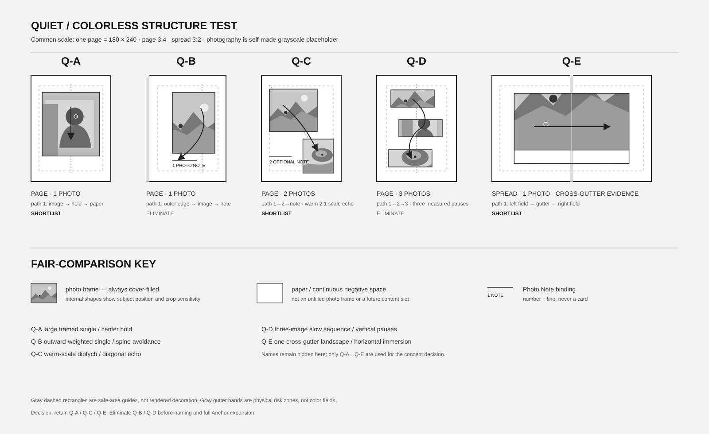
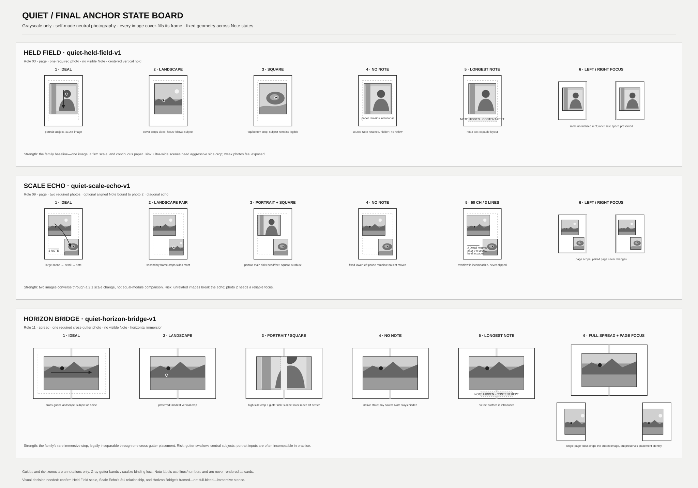

# Phase F3-A1：Quiet Family 首批 Anchor Brief

状态：**等待用户视觉审批；只完成 Quiet 家族 F3-A1 设计规格，不是 Recipe Definition 或 CatalogEntry。**  
日期：2026-08-13  
范围：5 个无色结构候选、淘汰 2 个、扩展 3 个 Anchor；不处理 Editorial、Grid/Contact、Dynamic、Chromatic，不进入 F3-B。

## 1. 视觉板

两张板只使用自制的中性灰度摄影占位内容；内部山形、人物和静物轮廓用于表示主体位置与 `cover` 裁切风险，不来自联网作品。概念板中的 3:4 单页均以相同的 `180 × 240` 显示，3:2 spread 以两个同尺度单页并排为 `360 × 240`，不把 spread 缩小冒充公平比较。虚线安全区、灰色书脊带、路径箭头和状态标签均为说明层，不属于未来 Renderer 资产。

## 2. 锁定输入与设计顺序

本批沿用已批准的 F2-D01 至 F2-D18，不修改任何角色位、scope 配比、Note 上限或 Contract 证据。具体硬边界：

- 单页固定 3:4；标准 spread 为派生 3:2。
- `spread` 只接受 `cross-gutter-photo` 或 required Photo–Note `cross-page-pair`。双图对话、共享轴线、留白平衡与色域均不构成证据。
- 照片槽始终 `cover` 满框；Photo Note 由照片/placement identity 绑定。
- Optional Note 缺失时不 reflow、不回收几何、不移动或扩大其他 Slot。
- Quiet 以照片、尺度、停顿和连续负空间先入；颜色、装饰和大量文字不参与候选差异。

五个候选均按 Playbook 四遍法中的前三遍顺序产生：先定义真实内容任务；再锁定无色 topology、主图尺度、负空间、主轴和阅读路径；最后才添加不可替代的 Typography Role 或 Photo Note relation。命名和稳定 ID 只授予入选的三个 Anchor。

## 3. 五个无色候选

### Q-A — 角色位 03：大尺度框内停顿

- **真实内容任务：** 让一张足以被长时间观看的肖像、静物或安静场景成为单页唯一事件，同时保留可感知纸边。
- **无色结构：** 一张约占画布 43.2% 的框内图；中心垂直轴；上下连续负空间不相等，以图像稍上置形成“进入—停留—离开”。
- **文字/关系：** 无可见文字或 Note；来源 Note 隐藏但保留。
- **内容适配：** portrait、square 最稳，landscape 可接受但需要左右焦点调整；弱图会因孤立而暴露。
- **差异与家族识别：** 它不是“小图居中”，而是接近 Quiet 框内面积上段的单一观看场；纸边负责减速，图像仍有足够信息量。
- **初评：** 差异 8/10；内容适配 9/10；Quiet 识别 9/10；**入选**。

### Q-B — 角色位 05：内侧避让单图

- **真实内容任务：** 保护靠近书脊一侧有重要主体的单图，并用外侧重心把视线带回页面。
- **无色结构：** 一张偏外侧的纵向图；edge 主轴；书脊侧形成最大连续负空间。
- **文字/关系：** optional `edge-related` caption，用编号和细线明确绑定。
- **内容适配：** 适合单侧有明确呼吸空间的肖像或室内；居中、对称和主体两侧都贴边的照片适配弱。
- **差异与家族识别：** outward 重心可辨，但左/右页转换后的主要价值很大程度来自镜像与页侧条件，结构职责与未来角色位 06 容易缠绕。
- **初评：** 差异 6/10；内容适配 7/10；Quiet 识别 8/10；**淘汰**。

### Q-C — 角色位 09：大小双图回声

- **真实内容任务：** 用一张场景图和一张细节/余韵图构成缓慢回声，而不是进行等权比较。
- **无色结构：** 大图约 24%、小图约 12.16%，面积比约 1.97:1；两图沿左上至右下的稳定对角趋势错开，之间的纸面是停顿，不是第三槽。
- **文字/关系：** photo 2 可带 optional `aligned` caption；Note 区与两张照片均不交叠，缺失时固定为 lower-left 连续负空间。
- **内容适配：** 场景＋细节、人物＋手部/物件、远景＋近景；两张无语义关系的照片会失效。
- **差异与家族识别：** 通过温和尺度差而非等模数、索引或密集扫描建立双图关系，明确区别 Grid/Contact。
- **初评：** 差异 9/10；内容适配 8/10；Quiet 识别 9/10；**入选**。

### Q-D — 角色位 10：三图缓慢序列

- **真实内容任务：** 用三张相邻时刻或同一地点的片段构成三个停顿，而不是快速 contact 扫描。
- **无色结构：** 三个等宽低矮框在垂直方向分开，中心位置轻微左右偏移；top-down 路径。
- **文字/关系：** 无 Photo Note，仅可使用一个弱 label，但本轮无色板将其去除以检查结构独立性。
- **内容适配：** 适合统一横向或可安全裁成横带的连贯组照；portrait 主体和混合比例需要重裁，鲁棒性不足。
- **差异与家族识别：** 虽有较大组间空白，重复等宽横带仍容易被理解为稀疏 contact；偏移稍加大又会滑向 Dynamic。
- **初评：** 差异 7/10；内容适配 6/10；Quiet 识别 6/10；**淘汰**。

### Q-E — 角色位 11：跨书脊全景停顿

- **真实内容任务：** 让一张具有水平空间连续性的照片形成 Quiet 家族的稀缺沉浸停顿，同时仍保留外部纸边。
- **无色结构：** 一张横向框内图跨越中心线，约占 spread 47.52%；horizontal 主轴从左侧场域穿过书脊到右侧场域。
- **文字/关系：** 无可见文字或 Note；来源 Note 隐藏但保留。
- **内容适配：** landscape、宽场景和主体离开中心的环境图最佳；portrait 和主体正落书脊的照片高风险。
- **合法 scope：** `spread`，由一个真实跨越 `x=1` 且允许 gutter crossing 的 Photo Slot 产生 `cross-gutter-photo` evidence；不是由双图、留白或共享轴线证明。
- **差异与家族识别：** 是本批唯一完整 spread 与唯一跨脊 placement，把 Quiet 的“停顿”从缩小图像转译为稀缺的水平沉浸。
- **初评：** 差异 10/10；内容适配 8/10；Quiet 识别 9/10；**入选**。

## 4. 淘汰结论

### 淘汰 Q-B

Q-B 的外侧重心本身优雅，但首批 Anchor 需要最大化结构覆盖。它与 Q-A 同为单图、框内、page、低密度；主要新增价值来自页侧镜像、主体位置与 optional caption。Pairwise 虽可勉强达标，却不是本批相对 Q-C 双图和 Q-E 合法 spread 更重要的结构职责。若未来扩展角色位 05/06，应同时验证 inward/outward 阅读语义，避免只把坐标镜像后算作两项。

### 淘汰 Q-D

Q-D 的三段停顿对统一横图组有效，但比例适配面太窄：竖图/方图要承受强烈上下裁切；去掉标签后，等宽重复横带更接近低密度 Grid/Contact。增加偏移或尺度跳变会转向 Dynamic，维持克制又不足以成为 Quiet 首批代表。它可在 F4 以“非等宽、非等距、仍可描述的三段序列”重新探索，但本批不保留。

## 5. Anchor 01 — Held Field

### 5.1 身份与内容用途

| 字段 | 规格 |
| --- | --- |
| 暂定名称 | Held Field / 凝驻场 |
| 稳定 Recipe ID | `quiet-held-field-v1` |
| family / version | `quiet` / `1` |
| 对应角色位 | Quiet 03：大尺度框内停顿 |
| 一句话用途 | 用一张有独立观看价值的照片建立安静、明确且不依赖文字的单页停留。 |
| scope | `page`；只改变当前页，不修改配对页。 |

### 5.2 内容能力与比例

- 照片数：`min=1`、`max=1`；一个 `required` Photo Slot。
- 偏好比例：`portrait`、`square`。
- 可接受比例：常规 `landscape`，前提是主体 focus 可移动。
- 风险比例：`ultra-wide`；框的近纵向形状会大量裁去左右内容。
- 最常见失败内容：低分辨率、主体横跨整个画面、重要人物同时贴近左右边缘、只能依赖说明文字理解的照片。

### 5.3 标准化几何

标准化 page 坐标为 `x=0..1, y=0..1`。

| Slot | kind | rect `{x,y,width,height}` | pageSide | required | z-index | 说明 |
| --- | --- | --- | --- | --- | ---: | --- |
| `photo-primary` | photo | `{0.14, 0.16, 0.72, 0.60}` | `left`（page scope 的局部页） | 是 | 10 | `fit: cover`；无 bleed、无 gutter crossing。 |

- canvas safeArea：`{0.10, 0.10, 0.80, 0.80}`；内外边距均位于 Quiet 10–22% 搜索带内。
- 主图面积：43.20%；照片覆盖率：43.20%；连续负空间率：56.80%。
- bleed：无；照片四边框内。
- 书脊：照片离内侧页面边缘至少 14%；不把主体默认放入 gutter loss。
- 第一入口：照片中心略上区域；主轴 `center / vertical`；路径“图像 → 停留 → 下方纸面离开”。

### 5.4 Note 与 Typography

- Note mode：`none`；不声明 Note Slot 或 relation。
- 任何来源 Photo Note 都保留在内容中并进入 hidden Note 状态，不删除、不截断、不转成静态文字。
- Typography Role：无；无 title、caption、label 或 folio。前景/承载面不适用。
- “最长 Note”压力状态：即使来源含长 Note，Renderer 也不生成文字 Slot；几何完全不变。

### 5.5 固定状态行为

- **无 Note：** 原生状态；全部纸面是完整构图，不是预留文字带。
- **照片不足：** 0 张为 `needs-content`，不生成无意义空照片框的 Reader 输出；Editor 可按统一产品行为显示诊断，但本 Brief 不发明 placeholder 视觉。
- **照片超量：** 第 2 张及以后进入 `unplacedPhotoIds`；不替换主图、不自动建对页。
- **长 Note：** 内容保留但隐藏；不压缩字号、不增加文字区。
- **横图：** `cover` 会裁左右；使用 placement focus 把主体保持在框内中央 60% 安全带。
- **竖图/方图：** 竖图最自然；方图主要裁上下，头顶/脚部仍需 focus 检查。
- **主体靠边：** 中心 focus 不是保证；若主体贴边且没有可移动空间，应判为中高风险或改用未来 Quiet 边缘角色。

### 5.6 Editor、Reader 与单页聚焦

- Editor 与 Reader 使用同一 rect、`cover`、focus 和 z-index；Reader 不显示安全区、虚线、路径箭头或占位说明。
- 左/右页应用保持相同标准化几何；page Recipe 不修改另一页。物理装订下，以既有内侧 14% 纸边保护主体。
- 单页聚焦中照片仍占 43.2%，不小于可辨认阈值；视觉板需由用户确认其“足够大而仍安静”的具体体感。

### 5.7 来源原则与转化

1. **结构来源：** [Adobe — Create and customize layout grids](https://helpx.adobe.com/indesign/desktop/layout-and-grid-tools/grids/create-customize-layout-grids.html)。来源说明边距、列与起始点共同形成结构，剩余空间成为 margin。转化：本 Anchor 用 4 列隐形骨架锁定 14% 侧边和 16% 顶起点；不复制 Adobe 参数、截图或字体。
2. **摄影书来源：** [Pentagram — Hair](https://www.pentagram.com/work/hair)。项目以受控、严谨、少评论的大幅肖像呈现，让设计服从照片的静止与差异。转化：只提取“单图规模 + 克制评论 + 重复基线”的原则，并改为 3:4 系统内的框内单页；不复制其照片、字体、纸张、项目名或具体页面。

### 5.8 Fingerprint、差异与评分

**Fingerprint：** `page / 1..1 / single / dominant 43.2% / center-vertical / enter-hold-exit / low density 43.2% photo + 56.8% negative / no bleed / note none / paper / no typography`。

与 Scale Echo 的差异：单图而非 warm-scale diptych；中心垂直停留而非对角回声；无 Note 能力；主图大 19.2 个百分点。与 Horizon Bridge 的差异：page 而非 spread；完整框不跨脊；中心垂直而非水平穿越；不存在 gutter placement 风险。

| 评分维度 | 得分 |
| --- | ---: |
| 照片内容与裁切鲁棒性 | 18/20 |
| 视觉层级和阅读清晰度 | 15/15 |
| 平衡、节奏与留白 | 14/15 |
| 家族识别度 | 14/15 |
| 相对其他 Recipe 的差异性 | 13/15 |
| 比例/数量适配性 | 8/10 |
| Photo Note 关系质量 | 5/5（明确 none，不制造错配） |
| 色彩、书脊和输出安全 | 5/5 |
| **自评** | **92/100** |

弱点：横图与 ultra-wide 裁切明显；照片本身不够强时版面无法用其他层级掩饰。淘汰条件：用户在真实单页焦点下认为图像仍像“普通小图居中”，或 landscape 主体安全率不足；若要放大到接近全页才成立，应回到角色 04 而不是偷改本 Anchor。

## 6. Anchor 02 — Scale Echo

### 6.1 身份与内容用途

| 字段 | 规格 |
| --- | --- |
| 暂定名称 | Scale Echo / 尺度回声 |
| 稳定 Recipe ID | `quiet-scale-echo-v1` |
| family / version | `quiet` / `1` |
| 对应角色位 | Quiet 09：大小双图回声 |
| 一句话用途 | 让一张场景图与一张细节图以温和尺度差和跨空白对角线产生迟缓回声。 |
| scope | `page`；双图对话不自证 spread，只改变当前页。 |

### 6.2 内容能力与比例

- 照片数：`min=2`、`max=2`；两个 Photo Slot 均 `required`。
- 偏好比例：photo 1 为 `landscape` 或 `square`；photo 2 为 `square`、近景 `portrait`。
- 可接受比例：photo 1 竖图、photo 2 常规 landscape，但均需 focus。
- 风险比例：两槽均为 `ultra-wide`；photo 2 的窄面积会大幅裁左右，尤其高风险。
- 最常见失败内容：两张没有语义回声、视觉权重完全相同、两张都含靠边人物，或需要逐图长说明才能关联。

### 6.3 标准化几何

| Slot | kind | rect `{x,y,width,height}` | pageSide | required | z-index | 说明 |
| --- | --- | --- | --- | --- | ---: | --- |
| `photo-scene` | photo | `{0.10, 0.13, 0.60, 0.40}` | `left` | 是 | 10 | 主场景；`cover`；框内。 |
| `photo-echo` | photo | `{0.52, 0.60, 0.38, 0.32}` | `left` | 是 | 10 | 细节/余韵；`cover`；框内。 |
| `note-echo` | note | `{0.10, 0.70, 0.32, 0.18}` | `left` | 否 | 20 | 仅绑定 `photo-echo`；与两 Photo Slot 不交叠。 |

- canvas safeArea：`{0.10, 0.10, 0.80, 0.82}`。
- 主图面积：24.00%；次图面积：12.16%；主次比约 1.97:1。
- 照片覆盖率：36.16%；固定负空间率：63.84%。Note 不计照片覆盖率。
- bleed：无；两图都完整框内。
- 书脊：左页/右页均以 page scope 局部坐标应用；内侧 10% 安全边界保留。两图之间不会跨脊。
- 第一入口：左上主场景；主轴 `diagonal trend`（稳定趋势，不是 Dynamic 的速度切分）；路径“scene → 纸面停顿 → echo → optional caption”。

### 6.4 Note 与 Typography

- Note mode：`optional`；relation 为 `aligned`。
- 绑定对象：`photo-echo` → `note-echo`，assignment 继续保存 `noteOfPhotoId`；板上的“2 + 线”只表示身份，不代替关系数据。
- 上限：60 字符、3 行；超过任一上限为 incompatible，不静默截断。
- Typography Role：`caption`；alignment `start`；foreground `ink`；唯一承载面 `paper`。
- Optional Note 缺失时 `note-echo` 不渲染，但 `photo-scene`、`photo-echo` 与任何其他几何均不移动。左下区域继续作为对角路径的反向重量和离开区成立。

### 6.5 固定状态行为

- **无 Note：** 两图几何完全不变；lower-left 空间是构图重量，不出现卡片或占位文字。
- **最长 Note：** 60 字符/3 行；保持在 `{0.10,0.70,0.32,0.18}` 内，超过时阻止应用。
- **照片不足：** 少于 2 张为 `needs-content`；不把单图扩到主槽，也不留下“缺样本”假空框。
- **照片超量：** 第 3 张及以后进入 `unplacedPhotoIds`；不自动形成三图。
- **横图：** photo 1 较适合；photo 2 要裁左右，主体必须靠近 focus。
- **竖图/方图：** photo 2 最稳；photo 1 竖图可能裁头脚或上下环境。
- **主体靠边：** 两个 placement 独立保存 focus；若两张主体都向页面外侧逃逸，阅读路径会分裂，应换图或换 Recipe。

### 6.6 Editor、Reader 与单页聚焦

- Editor/Reader 共用两张照片、一条可选 Note relation 与相同 z-order；Reader 不显示绑定编号、引导线或空 Note placeholder。
- 左页/右页保持相同 normalized topology，page Recipe 不改变对页。由于 inward/outward 不是本 Anchor 的核心语义，不把镜像算作新结构。
- 单页聚焦中小图仍需可辨认手部、物件或表情等核心信息；若 photo 2 只能充当装饰符号，本 Anchor 失败。

### 6.7 来源原则与转化

1. **结构来源：** [Adobe — Change document setup, margins, and columns](https://helpx.adobe.com/indesign/desktop/create-and-organize-pages/create-documents/change-document-setup.html)。来源区分 facing pages 的 inside/outside margins，并用 margins/columns 定位内容。转化：本 Anchor 用共同 10% 安全边界与不同列跨度生成 1.97:1 主次，不复制教程示例与参数。
2. **摄影序列来源：** [Aperture On Sight, Part II](https://aperture.org/curricpart/on-sight-part-ii/)。来源强调图片选择、上下文和 sequence 会改变意义，并要求思考图片如何相互说话。转化：将长序列压缩为一个场景—细节的两拍结构；关系必须来自内容回声，版面只提供尺度和停顿，不复制其教材图片或作品序列。

### 6.8 Fingerprint、差异与评分

**Fingerprint：** `page / 2..2 / warm-scale diptych / dominant 24%, 1.97:1 / diagonal trend / scene→echo→caption / low density 36.16% photo + 63.84% negative / no bleed / optional aligned caption / paper / caption`。

与 Held Field 的差异：2 张而非 1 张、diptych 而非 single、对角趋势而非中心垂直、optional aligned caption、主图面积显著更小。与 Horizon Bridge 的差异：page 而非 spread、双 placement 而非单 cross-gutter placement、低密度对角回声而非水平沉浸、可见 Photo Note 能力不同。

| 评分维度 | 得分 |
| --- | ---: |
| 照片内容与裁切鲁棒性 | 16/20 |
| 视觉层级和阅读清晰度 | 14/15 |
| 平衡、节奏与留白 | 14/15 |
| 家族识别度 | 14/15 |
| 相对其他 Recipe 的差异性 | 15/15 |
| 比例/数量适配性 | 8/10 |
| Photo Note 关系质量 | 5/5 |
| 色彩、书脊和输出安全 | 5/5 |
| **自评** | **91/100** |

弱点：最依赖正确选图；小图的裁切与可辨认度是主要风险。淘汰条件：用户第一眼将其读成 Editorial 主图＋证据图或稀疏 Contact；若需要 title/index 才能理解关系，归属错误；若 photo 2 在单页聚焦仍不可读，也必须淘汰或放大并重新做 pairwise。

## 7. Anchor 03 — Horizon Bridge

### 7.1 身份与内容用途

| 字段 | 规格 |
| --- | --- |
| 暂定名称 | Horizon Bridge / 地平桥 |
| 稳定 Recipe ID | `quiet-horizon-bridge-v1` |
| family / version | `quiet` / `1` |
| 对应角色位 | Quiet 11：跨书脊全景停顿 |
| 一句话用途 | 让一张水平连续、主体避开中心的场景跨越书脊，形成 Quiet 家族稀缺的沉浸停顿。 |
| scope | `spread`；由真实 `cross-gutter-photo` 客观证明。 |

### 7.2 内容能力与比例

- 照片数：`min=1`、`max=1`；一个 `required` cross-spread Photo Slot。
- 偏好比例：`landscape`；接近 3:2、16:9 或更宽但不极端的环境场景。
- 可接受比例：`square`，前提是左右有可裁空间且主体不在中心。
- 风险比例：`portrait`、`ultra-wide`。portrait 需要大幅裁上下/左右并重新定位；ultra-wide 虽方向相符，但 `cover` 到 1.44:0.66 框时会裁左右端点，不能假设完整保留。
- 最常见失败内容：主体、脸、文字标识或垂直建筑轴正落 `x=1`；两端都不可裁；需要 caption 才能理解的图片。

### 7.3 标准化几何与 spread evidence

spread 坐标为 `x=0..2, y=0..1`。

| Slot | kind | rect `{x,y,width,height}` | pageSide | required | z-index | 说明 |
| --- | --- | --- | --- | --- | ---: | --- |
| `photo-horizon` | photo | `{0.28, 0.17, 1.44, 0.66}` | `cross-spread` | 是 | 10 | `fit: cover`；`allowGutterCrossing: true`；框内跨脊。 |

- canvas safeArea：`{0.10, 0.10, 1.80, 0.80}`；gutter 风险带建议记录为 `{start:0.98,end:1.02}`，视觉人工检查扩大至约 `x=.94..1.06`。
- `photo-horizon` 严格满足 `x < 1` 且 `x + width = 1.72 > 1`，并允许 gutter crossing；派生 evidence 为 `{kind:"cross-gutter-photo", photoSlotId:"photo-horizon"}`。
- 没有第二张图、共享网格、标题或色域；本 Anchor 的 spread 身份不依赖描述性声明。
- 主图面积：以完整 spread 画布计 47.52%；照片覆盖率 47.52%；固定负空间率 52.48%。
- bleed：不触及外裁切边；这是框内跨脊，不是全出血。外部纸边帮助它仍被识别为 Quiet，而非沉浸式 Dynamic。
- 第一入口：左页画面开放区或由照片 focus 指定的非中心主体；主轴 `horizontal`；路径“左侧场域 → 书脊连续线 → 右侧场域 → 外部纸边”。

### 7.4 Note 与 Typography

- Note mode：`none`；无 Note Slot、无 `cross-page-pair`、无 Typography Role。
- 来源 Photo Note 保留但隐藏；不删除，也不把它放到对页来伪造第二类 evidence。
- “最长 Note”压力状态与 Held Field 相同：不产生文字 Slot，spread 几何固定。

### 7.5 固定状态行为

- **无 Note：** 原生状态；外部纸边和跨脊照片独立成立。
- **照片不足：** 0 张为 `needs-content`；spread 不应用半成品。
- **照片超量：** 第 2 张及以后进入 `unplacedPhotoIds`；不自动放到另一页。
- **长 Note：** 保留并隐藏；不生成对页文字、不改变 evidence。
- **横图：** preferred；仍需检查左右端点被 `cover` 裁去的幅度。
- **竖图/方图：** 方图可在有大背景余量时使用；portrait 通常为高风险，除非主体可放在某一页外侧且剩余环境能承受裁切。
- **主体靠边：** 边缘主体可能被外框裁切；placement focus 可调整，但不能同时拯救左右两个端点。
- **书脊：** 中心约 6% 扩展风险带不放脸、眼睛、文字或唯一关键物体；focus 只改变裁切，不消除物理装订损失。

### 7.6 Editor、Reader 与聚焦视角

- Editor/Reader 共用一个 placement identity；左右页 render plan 只是同一跨脊图的裁分，不重复计数。
- 从任一侧应用都必须选择完整两页并形成一次原子操作；本阶段仅记录预期，不实现或测试。
- 完整 spread 是主要审美视角；左/右单页聚焦只显示共享图的一段，仍需保留可理解的局部场域。若任一侧变成无意义裁片，Recipe 不通过。
- Reader 不显示书脊风险带、safeArea、裁切焦点或引导线。

### 7.7 来源原则与转化

1. **结构来源：** [Adobe — Adjust page and spread layout](https://helpx.adobe.com/indesign/desktop/layout-and-grid-tools/apply-layout-adjustments/adjust-page-or-spread-layout.html)。来源把 page 与 spread 作为可分别调整的结构单位，并强调保持对象对齐、间距与图像比例。转化：使用统一 `x=0..2` 坐标和固定外部纸边设计不可拆 spread；不复制 Adobe 的自动调整行为，本 Contract 也不假设 reflow。
2. **摄影书来源：** [Pentagram — Ghostlight](https://www.pentagram.com/work/ghostlight)。项目说明整书以全页单图、谨慎配对、多图网格和跨 gutter 横向构图交替形成节奏。转化：只提取“稀缺跨脊横图作为序列停顿”的原则，并把它收紧为一个框内、单图、无文字的 Quiet Anchor；不复制其摄影、棕褐色调、字体、装帧或具体 spread。

### 7.8 Fingerprint、差异与评分

**Fingerprint：** `spread / 1..1 / cross-gutter / dominant 47.52% / horizontal / left→gutter→right / medium density 47.52% photo + 52.48% negative / cross-gutter framed / note none / paper / no typography`。

与 Held Field 的差异：scope、topology、主轴、应用原子性和 gutter 风险均不同；二者虽同为单图无文字，观看经验分别是单页中心凝视与双页水平穿越。与 Scale Echo 的差异：单一跨页 placement，而非两个局部 placement；无 Note；主图面积大 23.52 个百分点；路径与 bleed/gutter 结构均不同。

| 评分维度 | 得分 |
| --- | ---: |
| 照片内容与裁切鲁棒性 | 16/20 |
| 视觉层级和阅读清晰度 | 15/15 |
| 平衡、节奏与留白 | 14/15 |
| 家族识别度 | 14/15 |
| 相对其他 Recipe 的差异性 | 15/15 |
| 比例/数量适配性 | 7/10 |
| Photo Note 关系质量 | 5/5（明确 none；evidence 不借 Note） |
| 色彩、书脊和输出安全 | 4/5 |
| **自评** | **90/100** |

弱点：三者中比例与书脊风险最高，单页聚焦也最容易出现无意义半幅。淘汰条件：真实装订预览中主体安全无法通过；左右单页任一侧持续不可读；或用户认为外部纸边削弱沉浸到不足以承担 Quiet 的独特能力。若改成全出血，应作为独立角色重新评分，不能静默改变本 Anchor。

## 8. Pairwise Difference Score

评分严格使用总计划 8 项规则；“留白结构”只在连续空间的职责发生改变时计分，不把微调边距算差异。

| Pair | scope 2 | 数量 1 | topology 2 | 主图尺度 1 | 主轴/路径 1 | bleed/留白 1 | Note 1 | 色彩/字体 1 | 总分 | Gate |
| --- | ---: | ---: | ---: | ---: | ---: | ---: | ---: | ---: | ---: | --- |
| Held Field ↔ Scale Echo | 0 | 1 | 2 | 1 | 1 | 1 | 1 | 1 | **8** | 通过 |
| Held Field ↔ Horizon Bridge | 2 | 0 | 2 | 0 | 1 | 1 | 0 | 0 | **6** | 通过 |
| Scale Echo ↔ Horizon Bridge | 2 | 1 | 2 | 1 | 1 | 1 | 1 | 1 | **10** | 通过 |

三对均 `>=4`，且每对至少一项来自 scope、topology、主图尺度、主轴或出血/留白结构。Held Field 与 Horizon Bridge 刻意共享“单图、无 Note、纸色”以证明差异不是靠文字或颜色制造；它们仍因 scope、cross-gutter topology、主轴与留白结构达到 6 分。

## 9. 本批来源清单与原创性边界

访问日期均为 2026-08-13：

- [Adobe — Create and customize layout grids](https://helpx.adobe.com/indesign/desktop/layout-and-grid-tools/grids/create-customize-layout-grids.html)：边距、列、起点与剩余空间的结构职责。
- [Adobe — Change document setup, margins, and columns](https://helpx.adobe.com/indesign/desktop/create-and-organize-pages/create-documents/change-document-setup.html)：facing pages、inside/outside margins 和栏沟。
- [Adobe — Adjust page and spread layout](https://helpx.adobe.com/indesign/desktop/layout-and-grid-tools/apply-layout-adjustments/adjust-page-or-spread-layout.html)：page/spread 结构与对象比例/间距一致性。
- [Aperture — On Sight, Part II](https://aperture.org/curricpart/on-sight-part-ii/)：选择、上下文、图像对话与 sequence 影响意义。
- [Pentagram — Hair](https://www.pentagram.com/work/hair)：受控、严谨、极少评论的摄影书节奏。
- [Pentagram — Ghostlight](https://www.pentagram.com/work/ghostlight)：单图、配对、网格与跨 gutter 横图的节奏交替。
- [MACK — Submissions](https://mackbooks.co.uk/pages/submissions)：以 draft sequence 和 image–text engagement 评估书本项目；本批仅作为研究校验，不直接供某一 Anchor 坐标。
- [MoMA — Photobook definition](https://www.moma.org/collection/terms/?filter=P)：sequence、placement、图文关系、scale 与 materiality 共同构成摄影书；用于复核本批不能只评一张缩略图。

不下载、不复用任何来源图片、纹理、字体、品牌素材或项目名；不逐坐标临摹来源页面。每个 Anchor 组合一个结构来源和一个摄影书/序列来源，并转换到本系统的 3:4 / 3:2、固定矩形、`cover`、Note identity 和 scope 证据中。

## 10. 已知风险与需要用户视觉选择的问题

1. **Held Field 的尺度：** 43.2% 是“足够被观看”与“仍有 Quiet 纸面”的折中。用户需判断它是否仍像普通居中图；若是，应优先改垂直位置或框比例，而不是只把图缩得更小。
2. **Scale Echo 的身份：** 用户需确认第一眼是“场景—细节的缓慢回声”，而不是 Editorial 的主图＋证据或 Grid/Contact 的两个样本。尤其检查无 Note 状态是否仍完整。
3. **Horizon Bridge 的沉浸度：** 本稿选择框内跨脊而非全出血，以保留 Quiet 身份和外边安全。用户需决定这种克制是否足够承担家族独特能力，还是后续应另做一个全出血角色比较；不能在本 Anchor 内静默切换。
4. **真实照片 Gate：** 灰度板只能确认 topology 和阅读路径，无法代替真实照片的色彩、分辨率、focus 与装订损失。F3-B 前仍需用户先批准三项概念；代码实现与 Preview Matrix 验证不在本批范围。

## 11. 阶段停止点

F3-A1 到此停止。未修改 TypeScript、TSX、CSS、Renderer 或测试；未创建 Definition、CatalogEntry 或注册 draft/active Recipe；未启动开发服务器、浏览器或自动化；未处理另外四个家族，也未进入 Editorial 或 F3-B。
